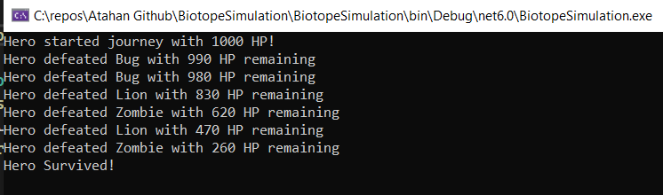
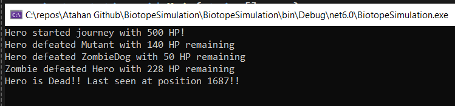

### Hero will survive or not ###
In the 23rd century the war between two empires led to a nuclear apocalypse which led to
extinction of nearly all civilization and animal life. As we are the only survivors we are trying to build
a new civilization but resources required to sustain life are rare. The radioactivity makes outdoors
dangerous. We are living in an old bunker that is left from WW2. Volunteers need to get out to the
dangerous lands and get to the places where they can get resources. Luckily the bunker we are
living has an old radar that can find creatures on our path to the resources. As a surviving engineer
you are required to write a simulation that can simulate if a volunteer can reach to resources. Be
aware that our radar indicates that there are dangerous creatures and even zombies on the
wasteland.
Write a simulation that find outs if the hero would survive or not. You can use the following sample
input and output as a reference. If the volunteer hero faces an enemy he needs to fight against it
until one of them dies. To simulate fights you can accept that enemy and the hero attack at the
same time. hp represents health points. Each attack decreases health points equal to attack. To
avoid radioactivity volunteer hero wears a special heavy armor that makes him walk meter by
meter.

|*Sample Input 1*                   |
| :---                              |
| Resources are 5000 meters away    |
| Hero has 1000 hp                  |
| Hero attack is 10                 |
| Bug is Enemy                      |
| Lion is Enemy                     |
| Zombie is Enemy                   |
| Bug has 50 hp                     |
| Bug attack is 2                   |
| Lion has 100 hp                   |
| Lion attack is 15                 |
| Zombie has 300 hp                 | 
| Zombie attack is 7                |
| There is a Zombie at position 1681|
| There is a Bug at position 276    |
| There is a Bug at position 489    |
| There is a Lion at position 1527  |
| There is a Lion at position 2865  |
| There is a Zombie at position 3523|

| *Sample Input 2*                           |
| :---                                       |
| Resources are 7500 meters away             |
| Hero has 500 hp                            |
| Hero attack is 9                           |
| ZombieDog is Enemy                         |
| Mutant is Enemy                            |
| Zombie is Enemy                            |
| Mutant has 400 hp                          |
| Mutant attack is 8                         |
| ZombieDog has 75 hp                        |
| ZombieDog attack is 10                     |
| Zombie has 300 hp                          |
| Zombie attack is 7                         |
| There is a Zombie at position 1687         |
| There is a Mutant at position 274          |
| There is a ZombieDog at position 486       |
| There is a ZombieDog at position 1897      |
| There is a Mutant at position 5332         |

